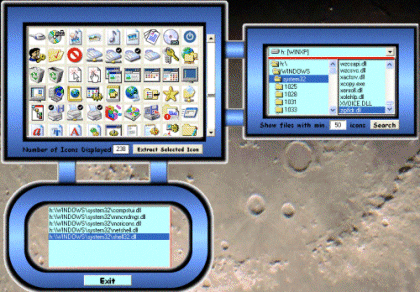



## Ikonz v1\.1

### Description

Last month's popular utility which could extract hidden icons from exe, dll and Ocx files is back. The new version has a cool interface( see screenshot)However the icons when saved as .ico files are not recognized as valid icons. If someone has a solution to this problem then please let me know.

I would appreciate your Comments and VOTES
 
### More Info
 

             |
---                |---
**Submitted On**   |2002-08-01 16:51:18
**By**             |[Gaurav Creations](https://github.com/Planet-Source-Code/PSCIndex/blob/master/ByAuthor/gaurav-creations.md)
**Level**          |Beginner
**User Rating**    |4.7 (42 globes from 9 users)
**Compatibility**  |VB 6\.0
**Category**       |[Complete Applications](https://github.com/Planet-Source-Code/PSCIndex/blob/master/ByCategory/complete-applications__1-27.md)
**World**          |[Visual Basic](https://github.com/Planet-Source-Code/PSCIndex/blob/master/ByWorld/visual-basic.md)
**Archive File**   |[Ikonz\_v1\_1113191812002\.zip](https://github.com/Planet-Source-Code/gaurav-creations-ikonz-v1-1__1-37485/archive/master.zip)

